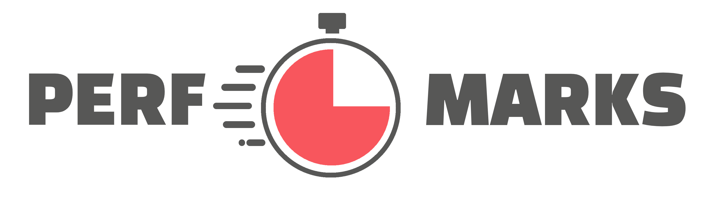
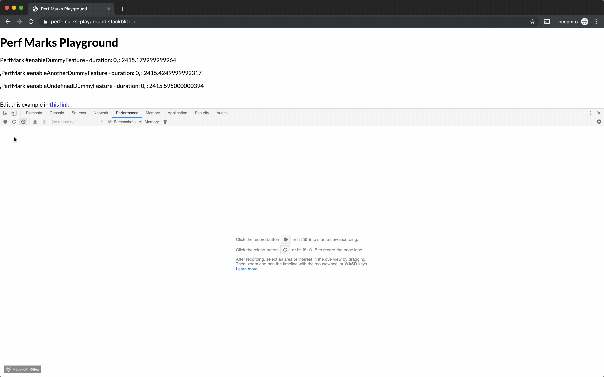

# Perf-marks

[](https://greenkeeper.io/)
[](https://stackblitz.com/edit/perf-marks-playground)

[](http://badge.fury.io/js/perf-marks) [](https://npmjs.org/perf-marks)
[](LICENSE)

[](https://circleci.com/gh/willmendesneto/perf-marks)
[](https://coveralls.io/r/willmendesneto/perf-marks?branch=master)
[](https://david-dm.org/willmendesneto/perf-marks)

[](https://npmjs.org/perf-marks)
[](https://npmjs.org/perf-marks)



### Why perf-marks?

> If you want to get more details about that, please read ["Cross-platform performance measurements with User Timing API and perf-marks"](https://willmendesneto.com/posts/cross-platform-performance-measurements-with-user-timing-apiand-perf-marks) blog post

That's the simplest and lightweight solution for [User Timing API](https://developer.mozilla.org/en-US/docs/Web/API/User_Timing_API) in Javascript. Simple how it should be.

You can find more details about it in the slides "[User Timing API: because performance matters](http://bit.ly/user-timing-api-because-perf-matters)"

## Contributing

Please check our [contributing.md](https://github.com/willmendesneto/perf-marks/blob/master/contributing.md) to know more about setup and how to contribute.

## Setup and installation

Make sure that you are using the NodeJS version is the same as `.nvmrc` file version. If you don't have this version please use a version manager such as `nvm` or `n` to manage your local nodejs versions.

> Please make sure that you are using NodeJS version 6.10.2

Assuming that you are using `nvm`, please run the commands inside this folder:

```bash
$ nvm install $(cat .nvmrc); # install required nodejs version
$ nvm use $(cat .nvmrc); # use nodejs version
```

In Windows, please install NodeJS using one of these options:

Via `NVM Windows` package: Dowload via [this link](https://github.com/coreybutler/nvm-windows). After that, run the commands:

```bash
$ nvm install $(cat .nvmrc); # install required nodejs version
$ nvm use $(cat .nvmrc); # use nodejs version
```

Via Chocolatey:

```bash
$ choco install nodejs.install -version 6.10.2
```

### Install yarn

We use `yarn` as our package manager instead of `npm`

[Install it following these steps](https://yarnpkg.com/lang/en/docs/install/#mac-tab)

After that, just navigate to your local repository and run

```bash
$ yarn install
```

## Demo

Try out our [demo on Stackblitz](https://perf-marks-playground.stackblitz.io)!



### Run the tests

```bash
$ yarn test # run the tests
```

### Run the build

```bash
$ yarn build # run the tests
```

### Run the bundlesize check

```bash
$ yarn bundlesize # run the tests
```

### Run the code lint

```bash
$ yarn lint # run the tests
```

## `PerfMarks`

This service exposes a few different methods with which you can interact with feature toggle service.

### `PerfMarks.start(markName)`

Adds the user timing api marker instrumentation in your application.

```js
import * as PerfMarks from 'perf-marks';

...
PerfMarks.start('name-of-your-mark');
...
```

### `PerfMarks.end(markName, markNameToCompare)`

Returns the results for the specified marker.

> `PerfMarks.end(markName)` calls `PerfMarks.clear(markName)` after return the mark values

If `markNameToCompare` value is not passed, the package will create a mark using `markName + '-end'`. Otherwise, it will compare based on the given mark.

> If you're passing `markNameToCompare` value, please make sure you're also started the mark with the same name previously

```js
import * as PerfMarks from 'perf-marks';

...
PerfMarks.start('name-of-your-mark');
...
const markResults: PerfMarks.PerfMarksPerformanceEntry = PerfMarks.end('name-of-your-mark');
```

### `PerfMarks.clear(markName)`

Removes the specified marker

```js
import * as PerfMarks from 'perf-marks';

...
PerfMarks.start('name-of-your-mark');
...
PerfMarks.clear('name-of-your-mark');
...
```

### `PerfMarks.clearAll()`

Removes all the markers

```js
import * as PerfMarks from 'perf-marks';

...
PerfMarks.start('name-of-your-mark');
PerfMarks.start('another-name-of-your-mark');
...
PerfMarks.clearAll();
...
```

### `PerfMarks.getNavigationMarker()`

Gets the marks for `navigation` loaded

```js
import * as PerfMarks from 'perf-marks';

...
const markResults: PerfMarksPerformanceNavigationTiming = PerfMarks.getNavigationMarker();
...
```

### `PerfMarks.getEntriesByType(markName)`

Gets the result for all marks that matches with the given mark name

```js
import * as PerfMarks from 'perf-marks';

...
PerfMarks.start('name-of-your-mark');
PerfMarks.start('another-name-of-your-mark');
...
// It will return results for all the marks that matches with `name-of-your-mark`
// In this case, `name-of-your-mark` and `another-name-of-your-mark`
const markResult: PerfMarksPerformanceNavigationTiming[] = PerfMarks.getEntriesByType('name-of-your-mark');
...
```

### `PerfMarks.isUserTimingAPISupported`

Boolean with the result of the check if User Timing API is supported for the current browser/NodeJS version.

> `PerfMarks` already have a fallback in case user timing is not supported. This boolean is exposed in case the app needs to check the case to use any other mechanism.

```js
import * as PerfMarks from 'perf-marks';

...
if (PerfMarks.isUserTimingAPISupported) {
  // ... Do something
}
...
```

### `PerfMarks.isPerformanceObservableSupported`

Boolean with the result of the check if PerformanceObservable is supported for the current browser/NodeJS version.

> `PerfMarks` does not provide a fallback if `PerformanceObservable` is not supported. This boolean is exposed in case the app needs to check the case to use any other mechanism.

```js
import * as PerfMarks from 'perf-marks';

...
// Checking if `PerformanceObservable` is supported for the current browser/NodeJS version
if (PerfMarks.isPerformanceObservableSupported) {
  try {
  // If yes, start the PerformanceObserver
    const observer: PerformanceObserver = new PerformanceObserver(list => {
      // ... Do something
    });

    // register observer based on the entryTypes
    // E.G. for long task notifications
    observer.observe({ entryTypes: ['longtask'] });
  } catch (e) {}
  // ... Finishing the observer
  observer.disconnect();
}
...
```

### `PerfMarks.profiler()`

Runs profiler using User Timing Api method to get user timing information. It will return a Promise with `mark` key with a `PerfMarksPerformanceEntry` type OR `mark` key + `data` key with the content for the callback method If the given callback returns something.

```js
const methodToBeMeasured = () => {
  /** method content */
};
// `res` will contain `mark` with the information and `data`
// if `methodToBeMeasured` returns something
const { mark, data } = PerfMarks.profiler(methodToBeMeasured, 'name-of-the-mark-for-this-method');
```

## Entrypoints

These are entrypoints for specific components to be used carefully by the consumers. If you're using one of these entrypoints we are assuming you know what you are doing. So it means that code-splitting and tree-shaking should be done on the consumer/product side.

By definition it will use CJS as the main distribution entrypoint used in the app. However, this can be changed in the consumer's bundle step. This is the built-in scenario if the consumer uses toolings such as `Webpack`, `Rollup`, or `Parcel`.

### Exposed entrypoints

- `perf-marks/marks`: it has all the methods for marks
  - `start`: Frontend and Backend support
  - `end`: Frontend and Backend support
  - `clear`: Frontend and Backend support
  - `clearAll`: Frontend and Backend support
  - `isUserTimingAPISupported`: _Deprecated (will be removed in v2). Use the value imported from `perf-marks/utils` instead_. Frontend and Backend support
  - `isPerformanceObservableSupported`: _Deprecated (will be removed in v2). Use the value imported from `perf-marks/utils` instead_. Frontend and Backend support
- `perf-marks/entries`: it has all the methods to get entries
  - `getNavigationMarker`: Frontend support only
  - `getEntriesByType`: frontend support only
- `perf-marks/utils`: it has all the feature, and platform checks and validations
  - `isNodeJSEnv`: Frontend and Backend support. Boolean with the result of the check if package is running on the browser or in a NodeJS environment
  - `isPerformanceObservableSupported`: Frontend and Backend support. Boolean with the result of the check if `PerformanceObservable` is supported for the current browser/NodeJS version
  - `isUserTimingAPISupported`: Frontend and Backend support. Boolean with the result of the check if User Timing API is supported for the current browser/NodeJS version
- `perf-marks/profiler`: it has all the feature, and platform checks and validations
  - `profiler`: Frontend and Backend support. profiler using User Timing Api method. It will return a Promise with `mark` key with a `PerfMarksPerformanceEntry` type or `mark` key + `data` key with the content for the callback method If the given callback returns something.

If you need optimize your bundle size even more, this package provides different bundles for `CommonJS`, `UMD`, `ESM`, `ES2015` and `ES2020`. To make the dev experience smoothiest as possible, you can use `babel-plugin-transform-imports` in your app and configure the bundle that fits the most for your app!

> Also, please make sure you configured your module bundler to support these optimized bundles based on your development loop. For Webpack, please check https://webpack.js.org/configuration/resolve/#resolvemainfields for more details or look for the module bundler documentation you're currently using.

```bash
yarn add -D babel-plugin-transform-imports
# or
npm install --save-dev babel-plugin-transform-imports
```

Create a `.babelrc.js` file in the root directory of your project:

```js
const plugins = [
  [
    'babel-plugin-transform-imports',
    {
      'perf-marks/perf-marks': {
        // Use "transform: 'perf-marks/perf-marks/${member}'," if your bundler does not support ES modules
        transform: 'perf-marks/dist/esm/${member}',
        preventFullImport: true,
      },
      'perf-marks/entries': {
        // Use "transform: 'perf-marks/entries/${member}'," if your bundler does not support ES modules
        transform: 'perf-marks/entries/esm/${member}',
        preventFullImport: true,
      },
    },
  ],
];

module.exports = { plugins };
```

Or just use it via `babel-plugin-import`

```bash
yarn add -D babel-plugin-import
# or
npm install --save-dev babel-plugin-import
```

Create a `.babelrc.js` file in the root directory of your project:

```js
const plugins = [
  [
    'babel-plugin-import',
    {
      libraryName: 'perf-marks/entries',
      // Use "'libraryDirectory': ''," if your bundler does not support ES modules
      libraryDirectory: 'esm',
      camel2DashComponentName: false,
    },
    'entries',
  ],
];

module.exports = { plugins };
```

And enjoy! Yeah, it's simple like that 😉

## Publish

this project is using `np` package to publish, which makes things straightforward. EX: `np <patch|minor|major>`

> For more details, [please check np package on npmjs.com](https://www.npmjs.com/package/np)

## Author

**Wilson Mendes (willmendesneto)**

- <https://twitter.com/willmendesneto>
- <http://github.com/willmendesneto>
